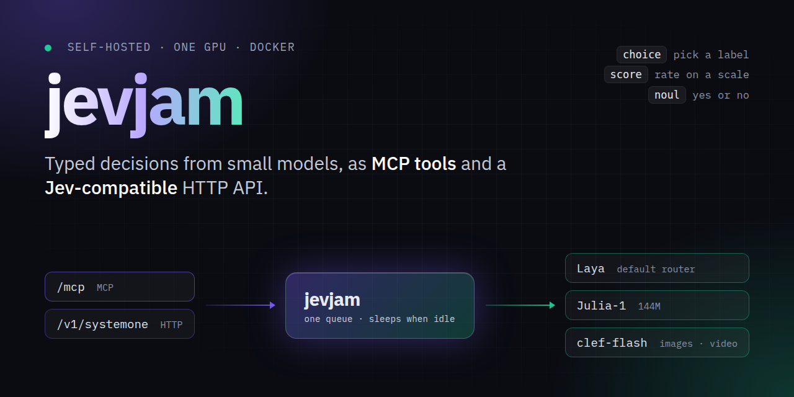

<p align="center">
  
</p>

<p align="center">
  <a href="https://github.com/beremaran/jevjam/actions/workflows/publish-image.yml"></a>
  <a href="https://github.com/beremaran/jevjam/releases/latest"></a>
  <a href="https://github.com/beremaran/jevjam/pkgs/container/jevjam"></a>
  <a href="https://modelcontextprotocol.io"></a>
  <a href="LICENSE"></a>
</p>

# jevjam

**Self-hosted MCP server and Jev-compatible HTTP API for small decision models, on one GPU, in Docker.**

Ask a model typed questions about a piece of text, JSON, an image or a video, and get
calibrated answers back in milliseconds: pick a label (`choice`), rate on a scale
(`score`), or answer yes or no (`noul`). Agents call it as [MCP](https://modelcontextprotocol.io)
tools; services call `POST /v1/systemone`, the same protocol as TypeSafe Jev, so a Jev
client only needs a new base URL.

Use it to route tickets, flag abuse, guard tool calls, pick a model for a prompt, or
any other decision you would rather not spend a large LLM call on.

## Models

| Model | By | Size | Reads | Picked when |
| --- | --- | --- | --- | --- |
| [Laya](https://huggingface.co/convaiinnovations/laya) | Convai Innovations | 3 checkpoints, ~1.2B in all | text, JSON | by default; its router picks English, multilingual or typed-decisions |
| [Julia-1](https://huggingface.co/SupersonicLabs/Julia-1) | Supersonic Labs | 144M | text, JSON | the request names `julia-1` |
| [clef-flash](https://huggingface.co/Cloudflare/clef-flash) | Cloudflare | 9B | text, JSON, images, video | the request names `clef-flash` |

One checkpoint stays in VRAM at a time, and it is freed after five idle minutes. See
[docs/models.md](docs/models.md) for sizes, quantization and limits.

## Quick start

You need Docker, an NVIDIA GPU, and the
[NVIDIA Container Toolkit](https://docs.nvidia.com/datacenter/cloud-native/container-toolkit/latest/install-guide.html).

```bash
docker run -d --name jevjam --gpus all -p 127.0.0.1:8000:8000 \
  -v jevjam-models:/models ghcr.io/beremaran/jevjam:latest
```

Or, from a clone, `docker compose up -d`. No model downloads at boot; the first request
fetches what it needs into the `jevjam-models` volume, which takes minutes once.

**Ask over HTTP:**

```bash
curl -s http://127.0.0.1:8000/v1/systemone -H 'Content-Type: application/json' -d '{
  "state": "We were billed twice for March. Refund it today or we cancel.",
  "questions": {
    "department": {"type": "choice", "instructions": "Who should handle this?",
                   "criteria": {"billing": "payments, refunds", "technical": "bugs, outages"}},
    "churn_risk": {"type": "noul", "instructions": "Does the user threaten to leave?"}
  }
}'
```

The answer, trimmed:

```json
{
  "answers": {
    "department": {"type": "choice", "choice": "billing", "probabilities": {"billing": 0.97, "technical": 0.03}, ...},
    "churn_risk": {"type": "noul", "noul": 0.82, ...}
  },
  "routing": {"model": "english", "reason": "English Latin text", ...}
}
```

**Or connect an agent over MCP**, at `http://127.0.0.1:8000/mcp`:

```bash
claude mcp add --transport http jevjam http://127.0.0.1:8000/mcp   # Claude Code
codex mcp add jevjam --url http://127.0.0.1:8000/mcp                 # Codex
```

Agents get four tools: `jevjam_predict`, `jevjam_preset` (`guard`, `moderation`,
`triage`, `model_router`), `jevjam_route` and `jevjam_status`. The
[MCP guide](docs/mcp.md) covers OpenCode, Pi, remote access and reverse proxies.

## Features

- **One process, two doors.** The HTTP API and MCP share one queue and one resident
  model, so neither starves the other of VRAM.
- **Sleeps when idle.** After `JEVJAM_IDLE_TIMEOUT` seconds (300 by default) every
  checkpoint is freed and the GPU memory goes back to the driver. The next request
  loads only what it needs; Laya wakes in 0.6 s on an RTX 4070 Ti SUPER.
- **Fits the card it finds.** clef-flash loads in BF16, 8-bit, 4-bit, or split across
  GPU and CPU, whichever fits.
- **Drop-in for Jev.** Same request and response shapes; unknown fields are ignored.
- **Locked down by default.** Runs as non-root, binds to loopback in Compose, and
  takes an optional bearer key (`JEVJAM_API_KEY`) for both endpoints.

## Docs

| Guide | What is in it |
| --- | --- |
| [Configuration](docs/configuration.md) | Running, settings, the model cache, sleeping on idle |
| [MCP server](docs/mcp.md) | Tools, auth, client setup, reverse proxies |
| [HTTP API](docs/api.md) | `/health`, `/v1/systemone`, question types, JSON Schema, errors |
| [Models](docs/models.md) | Laya, Julia-1 and clef-flash: sizes, VRAM, limits |

## Moving from laya-docker

This repo used to be `laya-docker`. The old image, `ghcr.io/beremaran/laya-docker`,
gets no more updates; switch to `ghcr.io/beremaran/jevjam`. Old `LAYA_*` settings
still work and log a warning; see [Configuration](docs/configuration.md#settings).

## Contributing

Bug reports and pull requests are welcome; see [CONTRIBUTING.md](CONTRIBUTING.md).
Report security problems privately, as [SECURITY.md](SECURITY.md) describes.

## License

jevjam is licensed under [Apache-2.0](LICENSE). The image also contains the
Apache-2.0 [Laya](https://github.com/NandhaKishorM/laya) package and checkpoints by
Convai Innovations, the Apache-2.0 Julia-1 code and checkpoint by Supersonic Labs, and
the Apache-2.0 clef-flash code and checkpoint by Cloudflare. The clef-flash code is
copied into `src/jevjam/vendor/` with its license.
